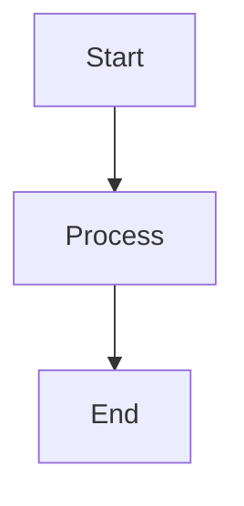

# Diagram Template

## Diagram Title

### Purpose
Brief description of what this diagram illustrates.

### Mermaid Diagram

### Description
Detailed explanation of the diagram components and flow.

### Usage in Book
Reference to which chapter/section this diagram belongs to.
